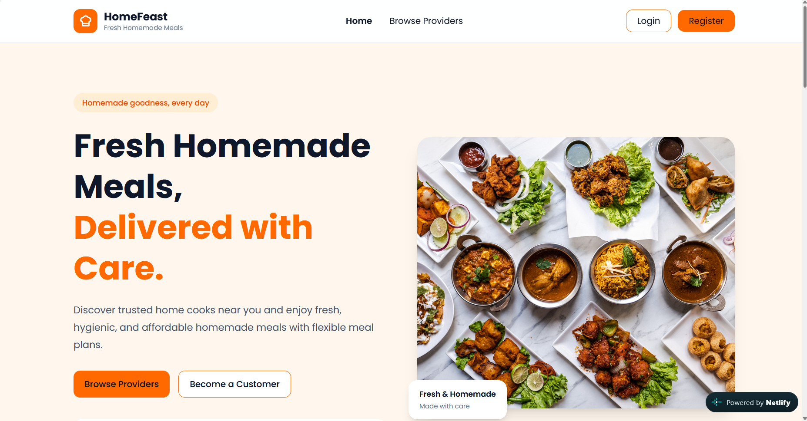
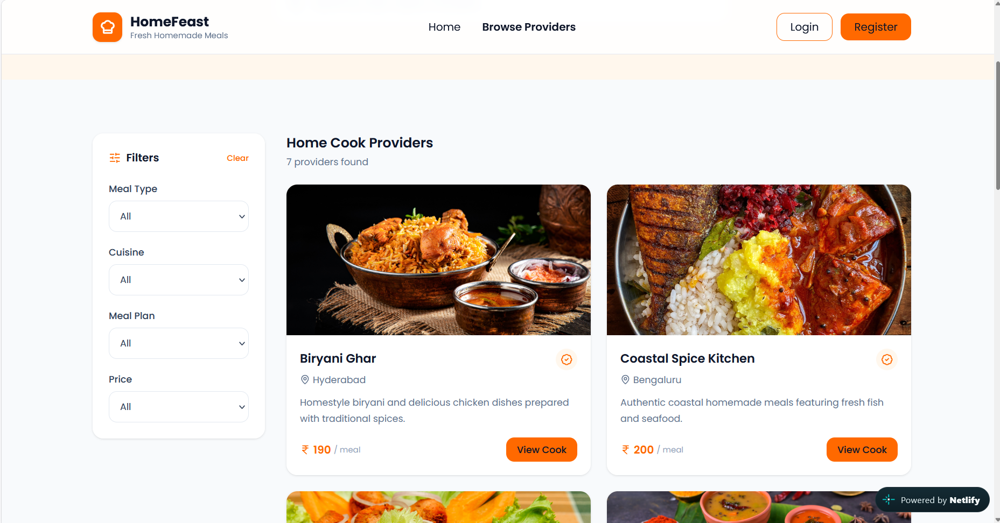
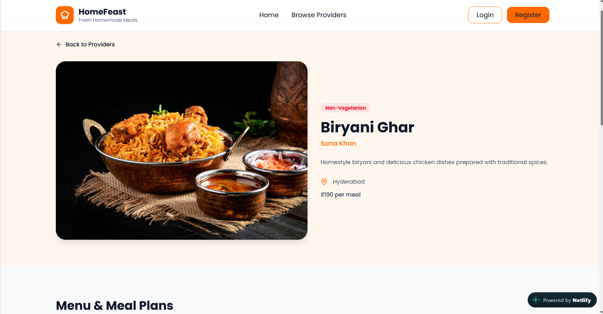
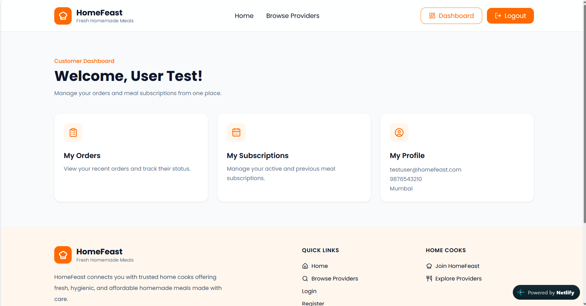
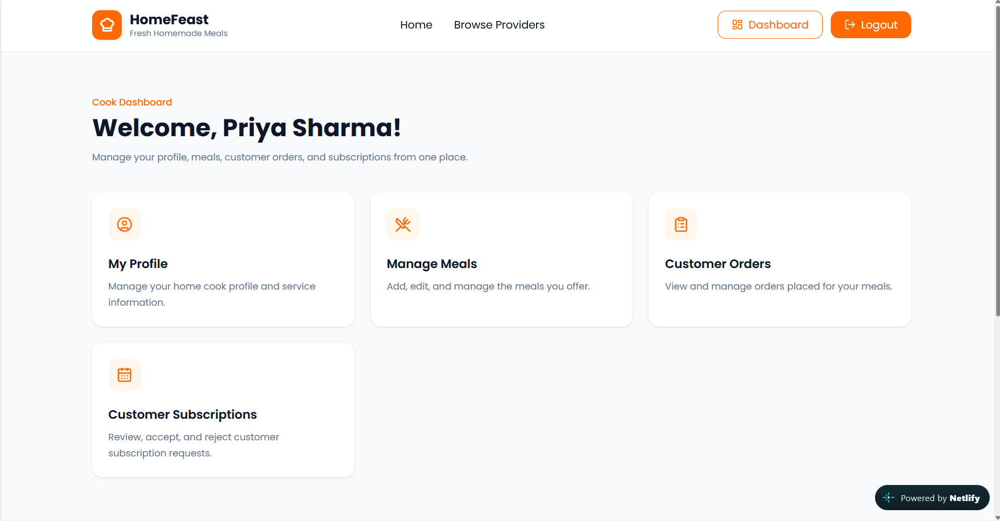
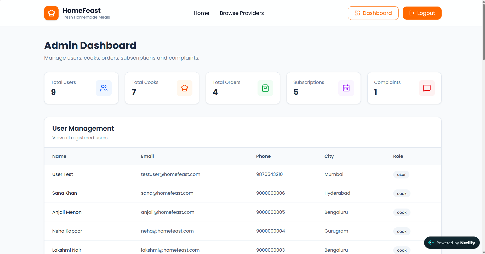

# 🍱 HomeFeast – Homemade Tiffin & Food Service Platform

HomeFeast is a full-stack MERN web application that connects customers with home cooks and tiffin service providers offering fresh, hygienic, and affordable homemade meals.

The platform allows customers to discover home cooks, explore available meals, place food orders, and subscribe to flexible meal plans. Home cooks can manage their profiles, meals, orders, and subscriptions, while administrators can manage users, cooks, orders, subscriptions, categories, and complaints through a secure admin dashboard.

---

## 🌐 Live Demo

https://homefeast-hub.netlify.app/

---

## 💻 GitHub Repository

https://github.com/Aatiqueshaikh/HomeFeast

---

## 📖 Project Overview

HomeFeast is designed to solve a common problem faced by students, working professionals, and people living away from home who struggle to find reliable homemade food.

Traditional food delivery platforms mainly focus on restaurants and individual food orders. HomeFeast focuses on connecting customers with local home cooks and tiffin service providers who offer homemade meals with flexible daily, weekly, and monthly meal plans.

The platform provides dedicated functionality for three roles:

- 👤 Customer
- 👨‍🍳 Cook
- 🛡️ Admin

The complete flow allows customers to register, browse providers, search and filter meals, view cook profiles, place orders, subscribe to meal plans, and manage their activities from their dashboard.

---

## ✨ Features

### 👤 Customer Features

- User Registration
- User Login & Logout
- JWT Authentication
- Protected Customer Routes
- Browse Home Cooks & Tiffin Providers
- Search Providers
- Filter Providers by Cuisine
- Filter by Food Type
- Filter by Price
- Filter by Meal Plan
- View Cook Profiles
- View Cook Details
- View Available Meals
- View Meal Plans
- View Meal Availability
- Place Food Orders
- View My Orders
- View Order Details
- Cancel Orders
- Subscribe to Meal Plans
- View My Subscriptions
- View Subscription Details
- Cancel Subscriptions
- Submit Complaints
- Customer Dashboard
- Customer Profile

---

### 👨‍🍳 Cook Features

- Cook Registration & Login
- Secure Authentication
- Protected Cook Routes
- Cook Dashboard
- View Cook Profile
- Edit Cook Profile
- Manage Meals
- Add Meals
- Edit Meals
- Set Meal Price
- Set Meal Type
- Set Meal Plan
- Set Food Type
- Set Meal Availability
- Add Meal Images & Details
- View Customer Orders
- View Customer Information
- View Meal Information
- Accept & Confirm Orders
- Update Order Status
- View Customer Subscriptions
- Accept Subscriptions
- Reject Subscriptions

---

### 🛡️ Admin Features

- Secure Admin Login
- JWT Authentication
- Role-Based Authorization
- Protected Admin Routes
- Admin Dashboard
- View Users
- Manage Cooks
- Verify & Approve Cooks
- Remove Cook Approval
- Monitor Orders
- Monitor Subscriptions
- Manage Categories & Cuisines
- View Complaints
- Resolve Complaints

---

## 🍛 Homemade Cuisines

HomeFeast provides an easy way to explore homemade food by cuisine.

Currently available cuisine categories include:

- 🇮🇳 North Indian
- 🌴 South Indian
- 🥘 Gujarati
- 🍛 Maharashtrian

Cuisine cards are interactive and take users directly to matching providers.

---

## 🔐 Authentication & Authorization

HomeFeast implements secure authentication and role-based access control.

### Authentication

- JSON Web Token (JWT)
- Password hashing with bcryptjs
- Protected routes
- Role-based authorization
- Persistent login using localStorage

### User Roles

```text
Customer
   │
Cook
   │
Admin
```

### 🛠 Tech Stack

**Frontend**
- React.js
- Vite
- Tailwind CSS
- React Router
- Lucide React
- JavaScript

**Backend**
- Node.js
- Express.js
- REST API

**Database**
- MongoDB Atlas
- Mongoose

**Authentication & Security**
- JSON Web Token (JWT)
- bcryptjs
- Protected Routes
- Role-Based Authorization

**Deployment & Tools**
- Netlify
- Render
- MongoDB Atlas
- GitHub
- GitHub Desktop

## 🗄️ Database Models

HomeFeast uses MongoDB with Mongoose for database management.

### User

Stores:

- Name
- Email
- Phone
- City
- Password
- Role

### Cook

Stores:

- User Reference
- Business Name
- Description
- City
- Food Type
- Price Per Meal
- Verification Status
- Image

### Meal

Stores:

- Cook
- Name
- Description
- Category
- Meal Type
- Food Type
- Meal Plan
- Price
- Image
- Availability

### Order

Stores:

- User
- Cook
- Meal
- Quantity
- Total Amount
- Delivery Date
- Order Status

### Subscription

Stores:

- User
- Cook
- Plan Type
- Meal Type
- Start Date
- End Date
- Price
- Subscription Status

## 🔄 Order & Subscription Flow

### Food Order Flow

```text
Customer
   ↓
Browse Providers
   ↓
View Cook
   ↓
View Meals
   ↓
Place Order
   ↓
Cook Reviews Order
   ↓
Confirmed
   ↓
Order Processing
```

### Subscription Flow

```text
Customer
   ↓
Select Meal Plan
   ↓
Subscribe
   ↓
Pending
   ↓
Cook Accepts
   ↓
Active
```

If the cook rejects the subscription:

```text
Pending
   ↓
Cook Rejects
   ↓
Rejected
```

## 🔌 Backend API Routes

The backend provides REST API endpoints for the main application modules.

```text
/api/auth
/api/cooks
/api/meals
/api/subscriptions
/api/orders
/api/admin
/api/complaints
```

## 📂 Project Structure

```text
HomeFeast
│
├── client
│   ├── src
│   ├── public
│   ├── package.json
│   └── vite.config.js
│
├── server
│   ├── config
│   ├── controllers
│   ├── middleware
│   ├── models
│   ├── routes
│   ├── services
│   ├── server.js
│   └── package.json
│
├── netlify.toml
├── .gitignore
└── README.md
```

## 📸 Screenshots

### 🏠 Home Page

HomeFeast provides a modern landing page featuring homemade food, featured cooks, cuisine categories, and platform information.



### 🍱 Browse Providers

Customers can browse, search, and filter available home cooks and tiffin providers.



### 👨‍🍳 Cook Details

Customers can view cook information, meals, pricing, meal plans, and availability.



### 👤 Customer Dashboard

Customers can manage their profile, orders, and subscriptions.



### 👨‍🍳 Cook Dashboard

Cooks can manage their profile, meals, customer orders, and subscriptions.



### 🛡️ Admin Dashboard

Administrators can manage users, cooks, orders, subscriptions, categories, and complaints.



## 📱 Responsive Design

HomeFeast is built with responsive Tailwind CSS classes to provide a smooth experience across different screen sizes.

Responsive layouts have been implemented for:

- Navigation
- Forms
- Cards
- Provider listings
- Cook details
- Dashboards
- Buttons
- Grid layouts

## 🚀 Deployment

HomeFeast is deployed using:

- **Frontend:** Netlify
- **Backend:** Render
- **Database:** MongoDB Atlas
- **Source Code:** GitHub

The frontend communicates with the deployed backend through the production REST API.

## 📚 What I Learned

Through this project, I gained practical experience in:

- React Component Architecture
- React Router
- Tailwind CSS
- Responsive Web Design
- Vite
- REST API Development
- Node.js
- Express.js
- MongoDB Atlas
- Mongoose
- JWT Authentication
- bcryptjs
- Role-Based Authorization
- Protected Routes
- CRUD Operations
- Database Relationships
- Order Management
- Subscription Management
- Git & GitHub
- GitHub Desktop
- Netlify Deployment
- Render Deployment

## 🔮 Future Enhancements

The following features can be considered for future versions:

- 💳 Online Payment Integration
- 🔔 Real-Time Notifications
- 💬 In-App Chat Between Customers & Cooks
- 📍 Live Order Tracking
- 📱 Dedicated Mobile Application
- 📊 Advanced Analytics
- 🤖 AI-Based Meal Recommendations

## 👨‍💻 Author

**Mohammad Aatique Shaikh**

Software Developer | Data Analyst

## ⭐ If you like this project, consider giving it a star!
